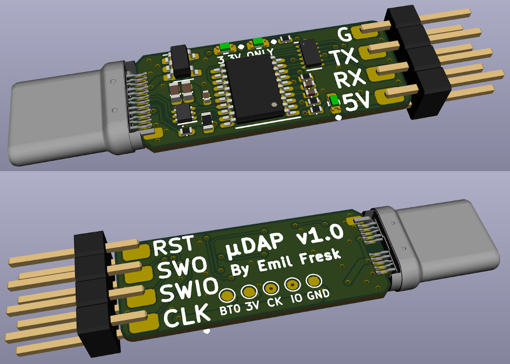

# Micro CMSIS-DAP Probe (µDAP)

A small [CMSIS-DAP](https://arm-software.github.io/CMSIS_5/DAP/html/index.html) probe, based on the pinout of the [dap42 firmware](https://github.com/devanlai/dap42).

## Changes

### v1.0

* First release

## Resources

### Schematics

TODO

### Programming instructions

The first time you connect the probe (if it has not been flashed yet) it will come up in DFU bootloader mode, and the following instructions will flash the probe:

```console
# Clone and build the firmware
git clone --recursive https://github.com/devanlai/dap42.git
cd dap42
make

# Flash the probe
cd build
dfu-util -d 1209:da42,0483:df11  -a 0 -s 0x08000000:leave -D DAP42.bin
```

Which should give the following output:

```console
# ....

DFU mode device DFU version 011a
Device returned transfer size 2048
DfuSe interface name: "Internal Flash  "
Downloading to address = 0x08000000, size = 15764
Download	[=========================] 100%        15764 bytes
Download done.
File downloaded successfully
Transitioning to dfuMANIFEST state
```

Now the probe is ready to use with `OpenOCD` using the following config file for `nrf52`, but you can replace it with any supported target:

```
# openocd_dap.cfg

source [find interface/cmsis-dap.cfg]
transport select swd
source [find target/nrf52.cfg]
```

### Usage

Using the previous config:

```console
openocd -f openocd_dap.cfg
```

Should give an output similar to:

```console
Open On-Chip Debugger 0.10.0+dev-00924-g16496488d (2019-08-18-15:42)
Licensed under GNU GPL v2
For bug reports, read
	http://openocd.org/doc/doxygen/bugs.html
Info : Listening on port 6666 for tcl connections
Info : Listening on port 4444 for telnet connections
Info : CMSIS-DAP: SWD  Supported
Info : CMSIS-DAP: FW Version = 1.0
Info : CMSIS-DAP: Interface Initialised (SWD)
Info : SWCLK/TCK = 1 SWDIO/TMS = 1 TDI = 0 TDO = 0 nTRST = 0 nRESET = 0
Info : CMSIS-DAP: Interface ready
Info : clock speed 1000 kHz
Info : SWD DPIDR 0x2ba01477
Info : nrf52.cpu: hardware has 6 breakpoints, 4 watchpoints
Info : nrf52.cpu: external reset detected
Info : Listening on port 3333 for gdb connections
```

### Images


